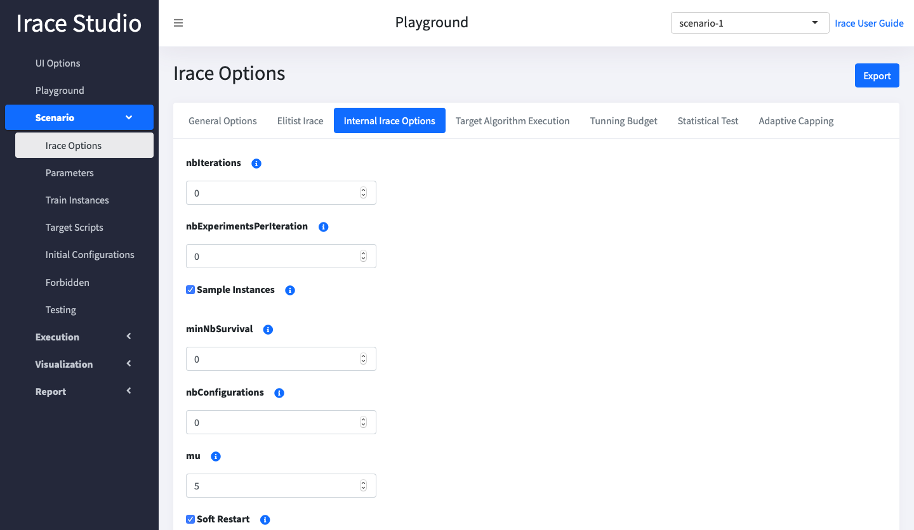

<h1 align="center">
  Irace Studio
</h1>

<h4 align="center">A Shiny App for <a href="https://mlopez-ibanez.github.io/irace/" target="_blank">Irace</a>.</h4>

<!-- badges: start -->
<p align="center">
  <a href="https://github.com/mrbarrientosg/iraceStudio/actions">
    
  </a>
  <a href="https://github.com/mrbarrientosg/iraceStudio/releases">
     
  </a>
  <a href="https://github.com/mrbarrientosg/iraceStudio/tags">
    
  </a>
  <a href="LICENSE.md"
    target="_blank">
    
  </a>
</p>
<!-- badges: end -->

<p align="center">
  <a href="#installation">Installation</a> •
  <a href="#how-to-use">How To Use</a> •
  <a href="#license">License</a> •
  <a href="#browsers-support">Browsers support</a>
</p>




## Installation

Previous to install R package you need to install some dependency before.

### GNU/Linux

```bash
$  sudo apt-get install libcurl4-openssl-dev libpoppler-cpp-dev libmagick++-dev pandoc pandoc-citeproc
```
### MacOS

On macOS you need install [brew](https://brew.sh):

```bash
# Install brew
$ /bin/bash -c "$(curl -fsSL https://raw.githubusercontent.com/Homebrew/install/master/install.sh)"

# Install dependencies
$ brew install poppler libmagic openssl pandoc pandoc-citeproc imagemagick@6
```
### Install Irace Studio

This package can be installed from Gtihub for the moment:
``` r
devtools::install_github("mrbarrientosg/iraceStudio")
```

## How To Use

To run Irace Studio:
``` r
library(iraceStudio)

runIraceStudio()
```
It's open automatically in the default browser, if not, you can open http://127.0.0.1:4350.

By default Irace Studio is running in port 4350, you can change this by passing parameter as you can see in the example below.
``` r
library(iraceStudio)

runIraceStudio(port = 8080)
```

## Browsers support

| [](http://godban.github.io/browsers-support-badges/)<br/>IE / Edge | [](http://godban.github.io/browsers-support-badges/)<br/>Firefox | [](http://godban.github.io/browsers-support-badges/)<br/>Chrome | [](http://godban.github.io/browsers-support-badges/)<br/>Safari |
| --------- | --------- | --------- | --------- |
| IE10, IE11, Edge| >= 38 versions | >= 45 versions | >= 9 versions

## License

The project is under [GPL3](LICENSE.md) license.